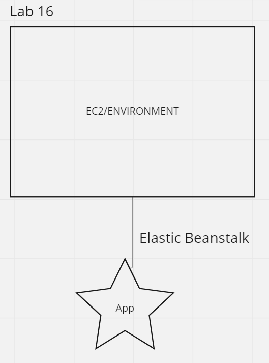

# LAB - Class 16

## Project: Cloud Server

### Author: Jacob Dang

### Problem Domain
This lab serves as an introduction to AWS basics and command line configurations

## Error
Ran into troubles getting a deployment through the command line. Instructor Ryan Gallaway & TA Justin Hammerly were unable to solve issues along side me, was requested to inform grading about issue.

### Links & Resources
{CLI Deployed} {URL}
{GUI Deployed} {http://basicexpressserver-env.eba-hkafvpii.us-west-2.elasticbeanstalk.com/}

### Features/Routes:
- Feature One:
    - Basic Express  

#### Tests
- How do you run tests?
    - node 

- Any tests of note:

## UML
